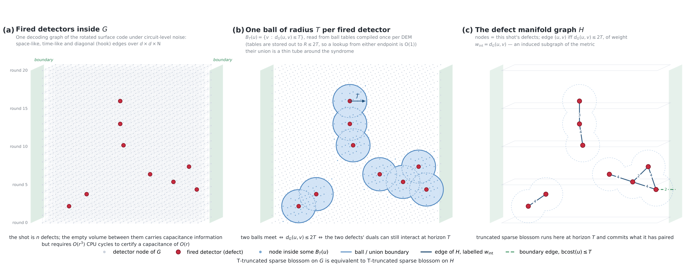

# SpecMatching

SpecMatching is a Python/C++ library that decodes quantum error-correction syndromes with
**minimum-weight perfect matching (MWPM)**, and does it with lower *per-shot latency* than the
decoder it is built on. It is a fork of [PyMatching](https://github.com/oscarhiggott/PyMatching)
(sparse blossom) with a speculative front end bolted on in front of the solver.


---

## The problem

A surface-code memory experiment produces one *shot* per logical time block: a syndrome — a set of
**detection events** ("defects") — that a decoder must turn into a correction before the next block
arrives. The standard exact method builds a **detector graph** `G` whose nodes are detectors and
whose edge weights are log-likelihood costs, and finds a minimum-weight perfect matching on the
defects. Sparse blossom (PyMatching v2) does this very fast in *throughput* terms, but it is a
single, inherently serial graph algorithm, and its time scales with the size of the whole graph `G`,
which grows as `d^3` in the code distance. Real-time decoding needs the *latency of one shot* to be
small, not the shots-per-second of a batch, and that is the number this repository attacks.

## The idea

For a fixed syndrome, most of `G` is irrelevant. Two defects can only ever be matched to each other
if the blossom algorithm's dual variables grow far enough to meet, and if you **cap** how far they
are allowed to grow — at a horizon `T` — then any pair further apart than `2T` can never interact.
So instead of solving on `G`, solve on a much smaller graph built per shot:



* **`H`, the ball graph** (also called the defect manifold). Its nodes are just this shot's defects.
  It has an edge between every pair of defects whose exact distance in `G` is at most `2T`, weighted
  by that exact distance, and a boundary edge for every defect within `T` of the code boundary.
  Distances come from precomputed **ball tables**: for every node of `G`, every node within radius
  `R` of it, the exact discretised distance and the observable mask of the canonical shortest path.
  The hard requirement is `R >= 2 * T` — a shorter radius silently changes answers.
* **The exactness certificate.** Run blossom on `H`. If it finishes and its terminal dual variables
  all satisfy `max_u Y(u) <= T`, the result is provably a **global** MWPM on `G`: extending the dual
  by zero off `H` is feasible for the full LP, every omitted edge has strictly positive slack, and
  complementary slackness holds. The matching, its weight and its observable flips are exactly what
  stock sparse blossom on `G` would have produced.
* **Escalation.** If the certificate fails — the run truncated at the horizon, or `H` has no perfect
  matching, or the terminal dual escaped `T` — the partial result is thrown away and the **whole**
  shot is re-decoded with stock exact sparse blossom on `G`.

**The output is exact MWPM on every shot.** The fallback is not an approximation and there is no
error budget to tune: it is the inherited decoder, run in full, on the shots the fast path could not
certify. `T` trades memory and escalation rate against speed.

## Why this is faster, and what "faster" means here

Two independent sources of speed:

1. **`H` is small.** At low physical error rate the ball graph over a shot's defects is a tiny,
   sparse graph compared to `G`, and it is what the solver actually walks.
2. **`H` falls apart.** The horizon guarantees that defects in different connected components of `H`
   can never interact, so each component is an *independent* MWPM problem and can be solved on its
   own core. What caps this is the largest component, which scheduling alone cannot split — so,
   following the division/fusion idea of Fusion Blossom (Wu & Zhong, 2023), an oversized component is
   **cut** into pieces of at most `n/k` components, where `n` is the number of defects and `k` is the
   number of parallel Sparse Blossom solvers.
   Each piece is solved as an independent problem in which the cut acts as a virtual boundary,
   and the pieces are then **fused** by unmasking the cut edges and continuing blossom from the
   combined primal-dual state. The result is still exact in matching weight.

**This is a latency win, not a throughput win.** Run back-to-back on a single core the decoder is
*slower* than stock, because it does strictly more total work per shot. What it buys is that most of
that work is off the critical path. The system model is: the sparsified path on `H` (over `k` solver
cores) and stock exact decode on `G` run **concurrently**, and the shot ends at the first usable
matching:

```
system = escalated ? fallback : min(fallback, sparse_k)
```

so an escalating shot loses a race it was running anyway — it never pays for two decodes in series.

## Measured speedups

The numbers below are the current **divide-and-conquer (fusion)** measurement in
produced by the `fusion_lb_profiler` binary.

**Settings.** Rotated surface code, `rotated_memory_x`, `rounds = d`, one observable; uniform
circuit noise `p = 0.001` (after-Clifford depolarisation, after-reset flip, before-measurement
flip); horizon `T = 2` lattice edge weights (`T_int = 32548`, ball radius `R = 2 T`); `k = 10`
solver cores, plus one resource-manager core and one fallback core; 100,000 shots per cell after
1,000 untimed warm-up shots; seed `20260910`; stim v1.16.0; git `1597694`; macOS, `-O3`,
thread-scoped CPU clock with 125.5 ns per read, raw uncorrected ticks.
Ran on an Apple M5 Pro chip (2026).

`fallback` is stock exact sparse blossom on `G` from the full syndrome, run on **every** shot.
`sparse_k` is the makespan of the simulated `k`-core schedule. `speedup` is
`mean(fallback) / mean(system)` over all shots, escalating ones included.

| `d` | shots | escalated | `fallback` | `sparse_k` | `system` | **speedup** | `system` p99 | `system` p99.9 |
|--:|--:|--:|--:|--:|--:|--:|--:|--:|
| 17 | 100,000 | 20 (0.020%) | 8.27 µs | 8.92 µs | 7.61 µs | **1.09x** | 13.42 µs | 17.17 µs |
| 25 | 100,000 | 54 (0.054%) | 35.72 µs | 14.91 µs | 14.93 µs | **2.39x** | 26.46 µs | 35.75 µs |
| 31 | 100,000 | 74 (0.074%) | 77.42 µs | 24.01 µs | 24.06 µs | **3.22x** | 37.62 µs | 52.12 µs |

The speedup grows with `d` because `fallback` scales with the whole of `G` (8.3 → 77.4 µs from
`d = 17` to `d = 31`) while the critical path scales with the pieces `H` breaks the shot into
(8.9 → 24.0 µs over the same range). At `d = 17` the two sides are nearly a wash; the decomposition
has real overhead and there is not enough work to hide it behind.

### Where the critical path goes

Means over non-escalating shots, in nanoseconds; the five columns sum to `sparse_k` by construction.
`manager` is the serial resource-manager core — union-find and the cut, building the fusion tree,
scattering the edge list into per-piece slices, job dispatch, and the final combine. `build` and
`leaf` are the two halves of one leaf job (construct the piece's subgraph, then solve it), `fuse` is
the fusion work, `extract` reads the matching out.

| `d` | manager | build | leaf solve | fuse | extract | `sparse_k` | manager share | work / path | pieces | tree depth |
|--:|--:|--:|--:|--:|--:|--:|--:|--:|--:|--:|
| 17 | 6,200 | 163 | 566 | 1,567 | 426 | 8,922 | 69% | 6.9x | 18.2 | 3.4 |
| 25 | 10,001 | 743 | 1,869 | 1,327 | 974 | 14,914 | 67% | 10.1x | 37.3 | 3.3 |
| 31 | 14,745 | 1,745 | 4,411 | 1,393 | 1,719 | 24,013 | 61% | 9.6x | 60.3 | 3.5 |

`work / path` is total solver work divided by the part of it on the critical path — the parallelism
the schedule actually extracts. The headline reading is that **the serial manager core is now the
bottleneck**: it is 61–69% of the modelled critical path, so the next win is in the preprocessing,
not in the blossom solve.

### Caveats that travel with these numbers

The `k`-core figure is a **model**, and the assumptions all cut the same way — `sparse_k` is a floor
on what `k` real cores would deliver, not a measurement of them:

* **One thread; no thread is ever spawned.** Every unit of work runs serially on the profiling
  thread, is timed individually, and a simulated list scheduler places those measurements on `k`
  cores. The makespan of that schedule is `sparse_k`.
* **No data-movement cost.** A shot's whole `H` lives in one shared solver instance that every
  simulated core addresses directly; the cache misses a real core would pay to touch another core's
  data are not modelled.
* **Warm cache.** A unit of work run immediately after another sees a warmer cache than a real core
  would.
* **Escalating shots have no makespan.** Such a shot stops at the job that truncated, so it is
  excluded from every `sparse_k` and critical-path figure. `fallback` and `system` cover every shot.
* Syndrome sampling, the ball-graph build, the (hardware-assumed) sort of the edge list and the
  instance reset are the *input* and sit outside every timed region.
* **Not distributed as a software tool.** Ball-graph precomputation is memory-bound on a CPU: the
  tables store, for every node of `G`, every node within `R` and its exact distance and observable
  mask. The design deliberately assumes the whole table is resident, because the hardware argument
  is local memory per node.
* **The win is regime-dependent.** It grows with `d` and collapses with `p`.


## Using it

The inherited PyMatching API is unchanged and still the way to decode.
But it is slower than PyMatching because it isn't intended to be used as a software decoder. :
The profilers can be built using CMake and have their source located in benchmarks/


## What is in the repository

```
src/specmatching/
  sparse_blossom/     vendored PyMatching v2.4.0, renamed wholesale (the solver)
  matching.py         the inherited Matching class — unchanged public API
  spec_matching/      everything new
    manifold/         ball tables (offline), the per-shot ball graph H, the Mwpm living on H,
                      component decomposition, artifact serialisation
    truncation/       the horizon: running a timeline until T, harvesting committed pairs out of
                      the surviving alternating trees, shattering exposed blossoms
    certificate/      the terminal max-dual test that certifies a shot globally optimal
    fusion/           the divide-and-conquer additions: edge masks, dummy boundaries, fusion
    escalation/       the residual fallback — re-decode the whole shot on G with stock
    driver/           SpecMatchingDecoder, the config, the pybind bindings
benchmarks/spec_matching/
  fusion_lb_profiler.cc     the divide-and-conquer profiler behind the table above
  load_balancer_profiler.cc the earlier k-core profiler behind docs/latency_speedups.md
  component_profiler.cc, sparse_graph_stats.cc, plot_*.py
tests/spec_matching/  C++ unit tests, fuzzers and the exactness cross-checks
docs/                 developer documentation, the latency report, upstream provenance
data/                 small DEMs, circuits and captured shot files used by tests and examples
```

## Attribution

The paper for the speculation-accelerated version `specmatching` is coming out soon.

When using SpecMatching please also cite the original papers on the sparse/fusion blossom
as `specmatching` is built on `pymatching` (Higgot & Gidney, 2023),
and the divide-and-conquer decomposition follows `fusion-blossom` (Wu & Zhong, 2023).

```
@article{Higgott2025sparseblossom,
  doi = {10.22331/q-2025-01-20-1600},
  url = {https://doi.org/10.22331/q-2025-01-20-1600},
  title = {Sparse {B}lossom: correcting a million errors per core second with minimum-weight matching},
  author = {Higgott, Oscar and Gidney, Craig},
  journal = {{Quantum}},
  issn = {2521-327X},
  publisher = {{Verein zur F{\"{o}}rderung des Open Access Publizierens in den Quantenwissenschaften}},
  volume = {9},
  pages = {1600},
  month = jan,
  year = {2025}
}
```

```
@inproceedings{wu2023fusion,
  title={Fusion blossom: Fast mwpm decoders for qec},
  author={Wu, Yue and Zhong, Lin},
  booktitle={2023 IEEE international conference on quantum computing and engineering (QCE)},
  volume={1},
  pages={928--938},
  year={2023},
  organization={IEEE}
}
```
